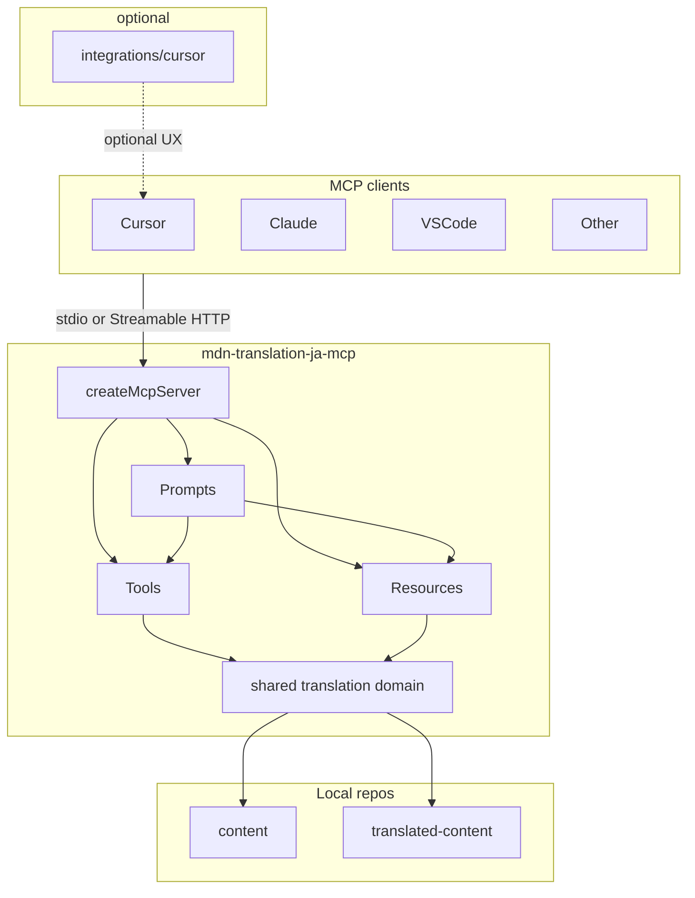

# MCP-native アーキテクチャと責務境界

親 Issue: [#103](https://github.com/gurezo/mdn-translation-ja-mcp/issues/103)
本 Issue: [#105](https://github.com/gurezo/mdn-translation-ja-mcp/issues/105)

入力: [#104](https://github.com/gurezo/mdn-translation-ja-mcp/issues/104) の棚卸し（[responsibility-inventory.md](./responsibility-inventory.md)）。本文書は棚卸しの **移行候補を決定** する。

後続: Resources は [#106](https://github.com/gurezo/mdn-translation-ja-mcp/issues/106)、Prompts は [#107](https://github.com/gurezo/mdn-translation-ja-mcp/issues/107)、Tools 再設計は [#108](https://github.com/gurezo/mdn-translation-ja-mcp/issues/108)（判断は [tools.md](./tools.md)）、Cursor 必須依存の解消は [#109](https://github.com/gurezo/mdn-translation-ja-mcp/issues/109)、他クライアント検証は [#110](https://github.com/gurezo/mdn-translation-ja-mcp/issues/110)、文書更新は [#111](https://github.com/gurezo/mdn-translation-ja-mcp/issues/111)。

## 目的

MCP サーバー、翻訳ガイドライン、ワークフロー、MCP クライアント固有設定の責務境界を定義する。最終的に、MCP クライアントはサーバーを登録するだけで MDN 日本語翻訳に必要な情報・操作へアクセスできる構成を目指す。

Cursor 専用の Rules / Skills は、必要な場合だけ利用する optional integration とする。`.cursor` や `.agents/skills` の削除自体は目的ではない。

## スコープ

本 Issue の成果物はこの文書のみである。ランタイムコードの変更、ディレクトリの実移動、README / GitHub Pages の刷新は行わない。

含める:

- 新アーキテクチャ図
- Tools / Resources / Prompts の責務定義
- Cursor 固有機能の責務定義
- 目標ディレクトリ構成
- 既存 API との互換方針
- 棚卸し文書の「#105 へ渡す未決事項」への回答

含めない:

- `registerResource` / `registerPrompt` の実装（#106 / #107）
- Tool の追加・改名（#108）
- `.cursor` / `.agents/skills` の移動・削除（#109）
- 他クライアント検証（#110）
- README / GitHub Pages / Examples の本格更新（#111）

`docs/` は TypeDoc 出力のため、本設計は置かない。

## 入力（棚卸し）

[responsibility-inventory.md](./responsibility-inventory.md) が現状と移行候補を固定している。要点だけ再掲する。

- MCP サーバーは Tools のみを登録している。Resources / Prompts は未登録。
- `MCP_SERVER_INSTRUCTIONS` は翻訳手順を `.cursor/skills/mdn-translation-workflow` へ誘導する。MCP サーバー単体では標準ワークフローを完結できない。
- 翻訳知識の正本が `.agents/skills`、`.cursor/rules`、`src/shared/data`、サーバー指示に分散し、重複している。
- 4 Tools のランタイムは Skill ファイルを読まず、`src/shared/data` の JSON と専用チェッカーを使う。
- stdio（`src/index.ts`）と Streamable HTTP（`src/http.ts`）は同じ `createMcpServer()` を使う。

本文書は上記を前提に、責務・配置・互換の **決定** を書く。

## 目標アーキテクチャ

MCP クライアントはサーバーを登録するだけで、Tools / Resources / Prompts と shared translation domain へ届く。Cursor Rules / Skills は必須条件にしない。

```text
MCP Client（Cursor / Claude / VS Code / other）
    │  stdio または Streamable HTTP
    ▼
mdn-translation-ja-mcp
├─ Tools
├─ Resources
├─ Prompts
└─ shared translation domain
       │
       ├─ content
       └─ translated-content

integrations/cursor/   … optional UX（接続雛形・薄い Rule）
```



### トランスポート

stdio（`src/index.ts`）と Streamable HTTP（`src/http.ts`）は、既存どおり同じ `createMcpServer()` に載せる。機能差をトランスポートに持たない。Tools / Resources / Prompts はすべてこのファクトリで登録する。

### クライアント非依存

サーバーが提供する知識・手順・操作は MCP の Tools / Resources / Prompts で完結する。特定クライアントのファイルパス（例: `.cursor/skills/...`）をサーバー指示に含めない。

Claude Code / VS Code 等での見え方の検証は #110。本設計は「同じ `createMcpServer()` が同じ三面を出す」ことだけを約束する。

## Tools / Resources / Prompts の責務

三面の境界を次で固定する。実装は #106 / #107 / #108。

| 面       | 責務                                   | 置くもの                                                                                                       | 置かないもの                             |
| -------- | -------------------------------------- | -------------------------------------------------------------------------------------------------------------- | ---------------------------------------- |
| Tool     | 決定的な副作用・機械検査               | 既存 4 Tools（`mdn_trans_start` / `mdn_trans_commit_get` / `mdn_trans_replace_glossary` / `mdn_trans_review`） | 自然言語翻訳、手順のオーケストレーション |
| Resource | クライアントが読む知識（読み取り専用） | 4 ガイドライン本文、glossary 抜粋、機械用 JSON                                                                 | 手順テンプレート、ファイル書き込み       |
| Prompt   | クライアント LLM 向け手順              | 翻訳フロー・同期・レビュー                                                                                     | サーバー内 LLM 実行                      |

### Tools

既存 4 Tools を MCP の操作面として維持する。

| Tool                         | 副作用                            | 読み取り                     |
| ---------------------------- | --------------------------------- | ---------------------------- |
| `mdn_trans_start`            | `translated-content` へ原文コピー | content の原文               |
| `mdn_trans_commit_get`       | `l10n.sourceCommit` 書き込み      | content の git 履歴          |
| `mdn_trans_replace_glossary` | glossary 第 2 引数を置換して保存  | `glossary-terms.json`        |
| `mdn_trans_review`           | なし（`readOnlyHint`）            | 対象 `index.md` と機械ルール |

CLI `npm run mdn:trans:review` は Tool のフォールバックであり、MCP の必須面にはしない。

高レベル Tool（例: `mdn_trans_prepare`）は追加しない。判断と代替（Prompt 合成）は [#108](./tools.md) が固定する。本 Issue では **4 Tools + Prompts で合成し、新 Tool を足さない**。LLM による自然言語翻訳は Tool に取り込まない。

### Resources

#106 の URI 案を採用する。実装時に MCP 仕様・SDK へ合わせて変更してよい。

| URI                                 | 内容                     | 現状の置き場                                              |
| ----------------------------------- | ------------------------ | --------------------------------------------------------- |
| `mdn://guidelines/editorial`        | 表記ガイドライン         | `.agents/skills/editorial-guideline/references/`          |
| `mdn://guidelines/l10n`             | L10N ガイドライン        | `.agents/skills/l10n-guideline/references/`               |
| `mdn://guidelines/japanese-style`   | 文体ルール               | `.agents/skills/japanese-style/references/style-rules.md` |
| `mdn://glossary`                    | 用語抜粋と Wiki 参照手順 | `.agents/skills/mozilla-l10n-glossary/references/`        |
| `mdn://data/glossary-terms`         | 機械用 glossary          | `src/shared/data/glossary-terms.json`                     |
| `mdn://data/review-rules`           | 機械チェックルール       | `src/shared/data/review-rules.json`                       |
| `mdn://data/prohibited-expressions` | 禁止・注意表現           | `src/shared/data/prohibited-expressions.json`             |

`mdn_trans_review` と Resource は同一データソースを使う（#106 の要件）。二重の正本は作らない。

Skill の `SKILL.md`（When to use / checklist）は Resource にしない。Prompt の手順に含める。`references/` 本文が Resource の正本である。

### Prompts

#107 の名称案を採用する。実装時に変更してよい。Prompt はサーバー内部で LLM を走らせない。クライアントの LLM に標準手順とコンテキストを渡す。

| Prompt          | 担う手順                                                                | 現状の置き場                                        |
| --------------- | ----------------------------------------------------------------------- | --------------------------------------------------- |
| `mdn_translate` | 翻訳開始 → ガイドライン参照 → 翻訳 → sourceCommit → glossary → レビュー | `.cursor/skills/mdn-translation-workflow/SKILL.md`  |
| `mdn_sync`      | 既存訳の `sourceCommit` 同期                                            | workflow Skill の subset、README                    |
| `mdn_review`    | 機械レビュー呼び出しと人手確認項目                                      | workflow Skill のレビュー節、`01-mdn-mcp-tools.mdc` |

`mdn_translate` が参照する Tool / Resource の順序は #107 の想定フローに従う。ツール対応表とパス指定は Prompt に含め、Cursor 専用 Skill を必須にしない。

### `MCP_SERVER_INSTRUCTIONS` の目標残量

`src/mcp-server-instructions.ts` は Prompt 実装（#107）と同時に薄くする。目標は次のみ。

- 4 Tools は MCP ツールでありシェルではない
- `mdn_trans_review` は読み取り専用
- ワークスペースは兄弟ディレクトリまたは `MDN_CONTENT_ROOT` / `MDN_TRANSLATED_CONTENT_ROOT`
- 標準手順は Prompt（`mdn_translate` / `mdn_sync` / `mdn_review`）を使う

**Cursor Skill パス（`.cursor/skills/mdn-translation-workflow`）への参照は削除する。** 他クライアントではそのパスが存在しない。

本 Issue では方針のみ。instructions の実編集は #107。

## Cursor 固有機能の責務

Cursor 固有設定は MCP 利用の必須条件にしない。optional 資産は `integrations/cursor/` に集約した（[#109](https://github.com/gurezo/mdn-translation-ja-mcp/issues/109)）。

```text
integrations/
└─ cursor/     … optional UX（接続雛形・薄い Rule）
```

MCP クライアントが必要なのは **サーバー登録だけ** である。Cursor では `.cursor/mcp.json`（または同等の MCP 設定）がそれに当たる。Rules / Skills がなくても、Tools / Resources / Prompts で基本翻訳フローを実行できる。

### optional として残すもの

| 現状                                            | 残す理由                                                                    |
| ----------------------------------------------- | --------------------------------------------------------------------------- |
| `.cursor/mcp.json`（本リポジトリ）              | Cursor のサーバー登録形式                                                   |
| `translated-content/.cursor/mcp.json` の生成    | 同上。他クライアントは各自の設定形式                                        |
| `scripts/setup-translated-content-cursor.mjs`   | Cursor 向け一括セットアップ。既定は `mcp.json` のみ。Rule は `--with-rules` |
| `integrations/cursor/`                          | Cursor 向け雛形                                                             |
| `.cursor/rules/01-mdn-mcp-tools.mdc` の薄い残置 | Cursor エージェントがツール名をシェル実行する問題への optional 対策         |
| `.cursor/skills` の残置                         | Cursor で Skill を開く UX が便利なら残してよい。正本は Prompt               |

### 必須から外すもの（知識は MCP 側へ）

| 現状                                              | 移行先                                                |
| ------------------------------------------------- | ----------------------------------------------------- |
| `.cursor/rules/00-mdn-translation.mdc`            | Resource（ガイドライン要約）および Prompt の前提節    |
| `.cursor/skills/mdn-translation-workflow`         | Prompt（`mdn_translate` / `mdn_sync` / `mdn_review`） |
| `.agents/skills` の translated-content へのコピー | Resource。Skill ラッパは optional                     |

translated-content ワークスペースへ `.cursor/rules` / `.cursor/skills` / `.agents/skills` をコピーしなくても、MCP サーバー登録だけで基本フローが走る（#109 で保証）。

### #109 で削除した候補

| 対象                                            | 理由                                                                        |
| ----------------------------------------------- | --------------------------------------------------------------------------- |
| `.cursor/settings.json` の `mdn-wdb-doc-ja-mcp` | 現行サーバー名・トランスポートと不一致。旧プロジェクト残骸。#109 で削除済み |

「削除」は便利な Cursor UX の全廃を意味しない。親 Issue #103 のとおり、optional integration として残してよい。

## 目標ディレクトリ構成と shared domain

本 Issue は正本の **論理的な所属** と目標ツリーを決める。実ファイルの移動は #106 / #109。移行完了まで `.cursor/` と `.agents/skills/` は現状維持する。

### 目標ツリー（未移動）

```text
src/
  create-mcp-server.ts      # Tools + Resources + Prompts を同一ファクトリで登録
  index.ts / http.ts        # トランスポートのみ
  mcp-server-instructions.ts
  tools/                   # 既存 4 Tools
  resources/               # #106 で追加
  prompts/                 # #107 で追加
  domain/                  # ガイドライン Markdown の将来の置き場（#106/#109）
  shared/                  # workspace, paths, JSON ローダ
  review/ git/ cli/

integrations/
  cursor/                  # #109 で .cursor 由来の optional 群を集約

architecture/              # 設計文書（本 Issue）
.cursor/ / .agents/skills/ # 移行完了まで現状維持
```

`src/index.ts` / `src/http.ts` はトランスポート専用とする。Resources / Prompts の登録をトランスポート側に置かない。

### filesystem 操作と翻訳知識の分離

| 層               | 役割                               | 現状のパス                                           |
| ---------------- | ---------------------------------- | ---------------------------------------------------- |
| filesystem / git | 原文コピー、front-matter、パス解決 | `src/tools` / `src/git` / `src/shared/workspace.ts`  |
| 翻訳知識（人手） | ガイドライン本文                   | `.agents/skills/*/references/`（将来 `src/domain/`） |
| 翻訳知識（機械） | レビュー・glossary 置換用 JSON     | `src/shared/data/*.json`                             |

Tools は filesystem と機械用 JSON を読む。Resources は人手 Markdown と機械 JSON を同じファイルから公開する。Prompts は手順だけを持ち、ガイドライン本文を複製しない。

### 単一ソース

二重の正本を作らない。

| 層                   | 正本                                                        | 派生                                 |
| -------------------- | ----------------------------------------------------------- | ------------------------------------ |
| 人が読むガイドライン | domain の Markdown（現状は `.agents/skills/*/references/`） | Resource が同じファイルを読む        |
| 機械チェック         | `src/shared/data/*.json`                                    | Tools と Resource が同一 JSON を読む |
| Agent Skill ラッパ   | `.agents/skills/*/SKILL.md`                                 | 正本ではない。#109 で optional 化    |

Markdown は人手知識、JSON は機械サブセットである。JSON を Markdown から生成するスクリプトの有無は #106 の実装詳細とする。

矛盾（例: `glossary-terms.json` の「ブラウザ」と表記ルールの「ブラウザー」）は Resource 化時（#106）に正本へ揃える。ルール ID の所属ずれ（`STYLE_L10N_METADATA` 等）も #106 または #108 で文書と実装を一致させる。

## 既存 API との互換方針

本設計の実装は **追加と移行** であり、既存の Cursor 利用者を本 Issue で壊さない。

### 凍結する範囲

- 既存 4 Tools の **名前・引数・副作用の範囲は維持** する（[#108](./tools.md)）。
- stdio と Streamable HTTP は常に同じ Tool / Resource / Prompt 集合を出す。
- CLI `npm run mdn:trans:review` は MCP 面の必須ではないフォールバックとして残す。
- Cursor 利用者は現行 `.cursor` のまま動く。本 Issue では `.cursor` / `.agents/skills` を移動・削除しない。

### 追加のみ（破壊的変更なし）

- Resource / Prompt は未登録の面を足すだけである。既存 Tool の呼び出し方は変えない。
- `MCP_SERVER_INSTRUCTIONS` の Cursor パス削除は Prompt 実装（#107）と同時に行う。本 Issue では方針のみ。
- setup スクリプトの Rules 自動コピー見直しは #109（完了。既定は `mcp.json` のみ）。

### 後続 Issue への引き渡し

| Issue | 本設計が渡す決定                                                                                        |
| ----- | ------------------------------------------------------------------------------------------------------- |
| #106  | Resource URI、正本（Markdown / JSON）、Tools と同一ソース                                               |
| #107  | Prompt 名、手順の所在、instructions の目標残量と Cursor パス削除                                        |
| #108  | 4 Tools を維持し、高レベル Tool は追加しない（[tools.md](./tools.md)）。本 Issue では新 Tool を足さない |
| #109  | `integrations/cursor/` への集約、optional 最小セット、`settings.json` 削除（完了）                      |
| #110  | 同じ `createMcpServer()` を他クライアントで検証                                                         |
| #111  | README を「MCP サーバー登録だけ」へ寄せる。本 Issue では更新しない                                      |

## 棚卸し未決事項への回答

[responsibility-inventory.md](./responsibility-inventory.md) の「#105 へ渡す未決事項」への決定。

| 未決事項                                               | 決定                                                                                                           |
| ------------------------------------------------------ | -------------------------------------------------------------------------------------------------------------- |
| Tools / Resources / Prompts の責務とディレクトリ構成   | 本文書の該当節。`integrations/cursor/` は optional の目標配置                                                  |
| instructions の残量                                    | Tool 制約・review 読み取り専用・ワークスペース・Prompt 名。Cursor Skill パスは削除                             |
| `.agents/skills` を正本にするか shared domain を切るか | 論理正本は domain Markdown（現状は `references/`）。`SKILL.md` はラッパ。物理移動は `src/domain/`（#106/#109） |
| JSON と Skill references の同期                        | 二重の正本を作らない。生成スクリプトの有無は #106                                                              |
| 4 Tools の名前・引数                                   | 維持する（[#108](./tools.md)）                                                                                 |
| Cursor Rule / Skill の最小セット                       | 接続設定 + 薄い `01-mdn-mcp-tools.mdc`。00 Rule と workflow Skill は必須から外す                               |
| 他クライアントでの見せ方                               | 同じ三面を出す。個別 UX は #110                                                                                |

## Issue #105 の完了対応

| 完了条件                                           | この文書での対応                         |
| -------------------------------------------------- | ---------------------------------------- |
| 新アーキテクチャ図が作成されている                 | 「目標アーキテクチャ」                   |
| Tools / Resources / Prompts の責務が定義されている | 「Tools / Resources / Prompts の責務」   |
| Cursor 固有機能の責務が定義されている              | 「Cursor 固有機能の責務」                |
| ディレクトリ構成案が決定している                   | 「目標ディレクトリ構成と shared domain」 |
| 既存 API との互換方針が決定している                | 「既存 API との互換方針」                |

## Issue #109 の完了対応

Cursor Rules / Skills は MCP 利用の必須条件ではない。

| 完了条件                                                      | 対応                                                                        |
| ------------------------------------------------------------- | --------------------------------------------------------------------------- |
| `.cursor/rules` がなくても基本翻訳フローを実行できる          | Prompt / Resource / Tool。setup は Rule をコピーしない                      |
| `.cursor/skills` がなくても基本翻訳フローを実行できる         | 正本は `mdn_translate` 等。Skill は optional                                |
| Cursor 固有設定が optional と明記されている                   | README と [integrations/cursor/README.md](../integrations/cursor/README.md) |
| setup script が不要なファイルをコピーしない                   | 既定は `mcp.json` のみ。`--with-rules` は任意                               |
| Cursor integration を追加した場合のメリットが明文化されている | [integrations/cursor/README.md](../integrations/cursor/README.md)           |
