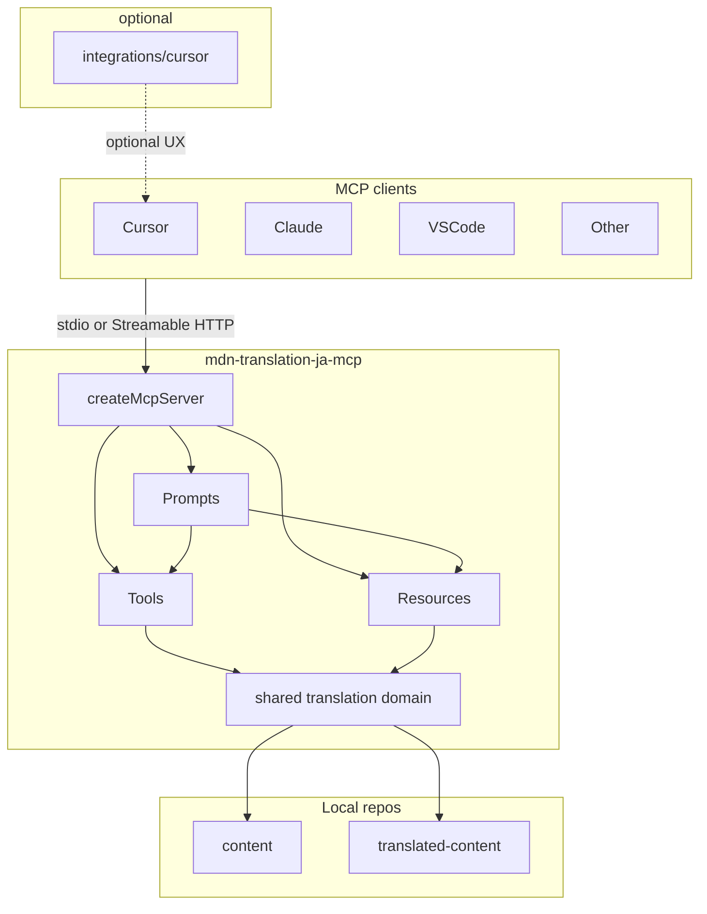

# MCP-native アーキテクチャと責務境界

親 Issue: [#103](https://github.com/gurezo/mdn-translation-ja-mcp/issues/103)
本 Issue: [#105](https://github.com/gurezo/mdn-translation-ja-mcp/issues/105)

入力: [#104](https://github.com/gurezo/mdn-translation-ja-mcp/issues/104) の棚卸し（[responsibility-inventory.md](./responsibility-inventory.md)）。本文書は棚卸しの **移行候補を決定** する。

後続: Resources は [#106](https://github.com/gurezo/mdn-translation-ja-mcp/issues/106)、Prompts は [#107](https://github.com/gurezo/mdn-translation-ja-mcp/issues/107)、Tools 再設計は [#108](https://github.com/gurezo/mdn-translation-ja-mcp/issues/108)、Cursor 必須依存の解消は [#109](https://github.com/gurezo/mdn-translation-ja-mcp/issues/109)、他クライアント検証は [#110](https://github.com/gurezo/mdn-translation-ja-mcp/issues/110)、文書更新は [#111](https://github.com/gurezo/mdn-translation-ja-mcp/issues/111)。

## 目的

MCP サーバー、翻訳ガイドライン、ワークフロー、MCP クライアント固有設定の責務境界を定義する。最終的に、MCP クライアントはサーバーを登録するだけで MDN 日本語翻訳に必要な情報・操作へアクセスできる構成を目指す。

Cursor 専用の Rules / Skills は、必要な場合だけ利用する optional integration とする。`.cursor` や `.agents/skills` の削除自体は目的ではない。

## スコープ

本 Issue の成果物はこの文書のみである。ランタイムコードの変更、ディレクトリの実移動、README / GitHub Pages の刷新は行わない。

含める:

- 新アーキテクチャ図
- Tools / Resources / Prompts の責務定義
- Cursor 固有機能の責務定義
- 目標ディレクトリ構成
- 既存 API との互換方針
- 棚卸し文書の「#105 へ渡す未決事項」への回答

含めない:

- `registerResource` / `registerPrompt` の実装（#106 / #107）
- Tool の追加・改名（#108）
- `.cursor` / `.agents/skills` の移動・削除（#109）
- 他クライアント検証（#110）
- README / GitHub Pages / Examples の本格更新（#111）

`docs/` は TypeDoc 出力のため、本設計は置かない。

## 入力（棚卸し）

[responsibility-inventory.md](./responsibility-inventory.md) が現状と移行候補を固定している。要点だけ再掲する。

- MCP サーバーは Tools のみを登録している。Resources / Prompts は未登録。
- `MCP_SERVER_INSTRUCTIONS` は翻訳手順を `.cursor/skills/mdn-translation-workflow` へ誘導する。MCP サーバー単体では標準ワークフローを完結できない。
- 翻訳知識の正本が `.agents/skills`、`.cursor/rules`、`src/shared/data`、サーバー指示に分散し、重複している。
- 4 Tools のランタイムは Skill ファイルを読まず、`src/shared/data` の JSON と専用チェッカーを使う。
- stdio（`src/index.ts`）と Streamable HTTP（`src/http.ts`）は同じ `createMcpServer()` を使う。

本文書は上記を前提に、責務・配置・互換の **決定** を書く。

## 目標アーキテクチャ

MCP クライアントはサーバーを登録するだけで、Tools / Resources / Prompts と shared translation domain へ届く。Cursor Rules / Skills は必須条件にしない。

```text
MCP Client（Cursor / Claude / VS Code / other）
    │  stdio または Streamable HTTP
    ▼
mdn-translation-ja-mcp
├─ Tools
├─ Resources
├─ Prompts
└─ shared translation domain
       │
       ├─ content
       └─ translated-content

integrations/cursor/   … optional UX（接続雛形・薄い Rule）
```



### トランスポート

stdio（`src/index.ts`）と Streamable HTTP（`src/http.ts`）は、既存どおり同じ `createMcpServer()` に載せる。機能差をトランスポートに持たない。Tools / Resources / Prompts はすべてこのファクトリで登録する。

### クライアント非依存

サーバーが提供する知識・手順・操作は MCP の Tools / Resources / Prompts で完結する。特定クライアントのファイルパス（例: `.cursor/skills/...`）をサーバー指示に含めない。

Claude Code / VS Code 等での見え方の検証は #110。本設計は「同じ `createMcpServer()` が同じ三面を出す」ことだけを約束する。
