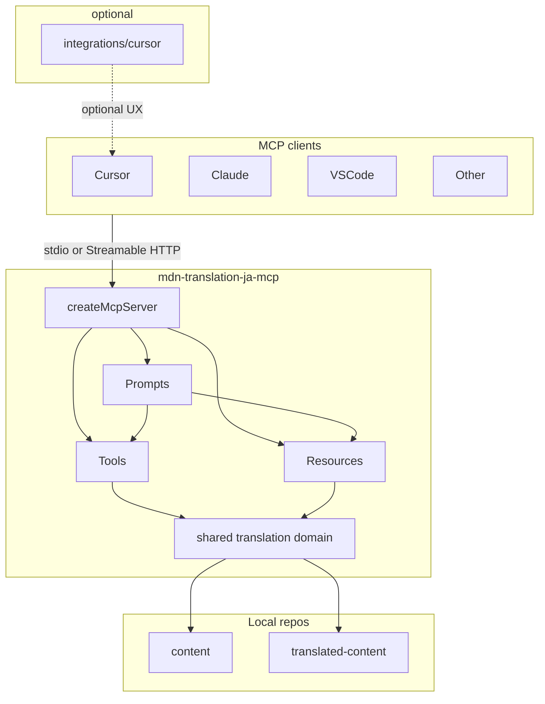

# MCP-native アーキテクチャと責務境界

親 Issue: [#103](https://github.com/gurezo/mdn-translation-ja-mcp/issues/103)
本 Issue: [#105](https://github.com/gurezo/mdn-translation-ja-mcp/issues/105)

入力: [#104](https://github.com/gurezo/mdn-translation-ja-mcp/issues/104) の棚卸し（[responsibility-inventory.md](./responsibility-inventory.md)）。本文書は棚卸しの **移行候補を決定** する。

後続: Resources は [#106](https://github.com/gurezo/mdn-translation-ja-mcp/issues/106)、Prompts は [#107](https://github.com/gurezo/mdn-translation-ja-mcp/issues/107)、Tools 再設計は [#108](https://github.com/gurezo/mdn-translation-ja-mcp/issues/108)、Cursor 必須依存の解消は [#109](https://github.com/gurezo/mdn-translation-ja-mcp/issues/109)、他クライアント検証は [#110](https://github.com/gurezo/mdn-translation-ja-mcp/issues/110)、文書更新は [#111](https://github.com/gurezo/mdn-translation-ja-mcp/issues/111)。

## 目的

MCP サーバー、翻訳ガイドライン、ワークフロー、MCP クライアント固有設定の責務境界を定義する。最終的に、MCP クライアントはサーバーを登録するだけで MDN 日本語翻訳に必要な情報・操作へアクセスできる構成を目指す。

Cursor 専用の Rules / Skills は、必要な場合だけ利用する optional integration とする。`.cursor` や `.agents/skills` の削除自体は目的ではない。

## スコープ

本 Issue の成果物はこの文書のみである。ランタイムコードの変更、ディレクトリの実移動、README / GitHub Pages の刷新は行わない。

含める:

- 新アーキテクチャ図
- Tools / Resources / Prompts の責務定義
- Cursor 固有機能の責務定義
- 目標ディレクトリ構成
- 既存 API との互換方針
- 棚卸し文書の「#105 へ渡す未決事項」への回答

含めない:

- `registerResource` / `registerPrompt` の実装（#106 / #107）
- Tool の追加・改名（#108）
- `.cursor` / `.agents/skills` の移動・削除（#109）
- 他クライアント検証（#110）
- README / GitHub Pages / Examples の本格更新（#111）

`docs/` は TypeDoc 出力のため、本設計は置かない。

## 入力（棚卸し）

[responsibility-inventory.md](./responsibility-inventory.md) が現状と移行候補を固定している。要点だけ再掲する。

- MCP サーバーは Tools のみを登録している。Resources / Prompts は未登録。
- `MCP_SERVER_INSTRUCTIONS` は翻訳手順を `.cursor/skills/mdn-translation-workflow` へ誘導する。MCP サーバー単体では標準ワークフローを完結できない。
- 翻訳知識の正本が `.agents/skills`、`.cursor/rules`、`src/shared/data`、サーバー指示に分散し、重複している。
- 4 Tools のランタイムは Skill ファイルを読まず、`src/shared/data` の JSON と専用チェッカーを使う。
- stdio（`src/index.ts`）と Streamable HTTP（`src/http.ts`）は同じ `createMcpServer()` を使う。

本文書は上記を前提に、責務・配置・互換の **決定** を書く。

## 目標アーキテクチャ

MCP クライアントはサーバーを登録するだけで、Tools / Resources / Prompts と shared translation domain へ届く。Cursor Rules / Skills は必須条件にしない。

```text
MCP Client（Cursor / Claude / VS Code / other）
    │  stdio または Streamable HTTP
    ▼
mdn-translation-ja-mcp
├─ Tools
├─ Resources
├─ Prompts
└─ shared translation domain
       │
       ├─ content
       └─ translated-content

integrations/cursor/   … optional UX（接続雛形・薄い Rule）
```



### トランスポート

stdio（`src/index.ts`）と Streamable HTTP（`src/http.ts`）は、既存どおり同じ `createMcpServer()` に載せる。機能差をトランスポートに持たない。Tools / Resources / Prompts はすべてこのファクトリで登録する。

### クライアント非依存

サーバーが提供する知識・手順・操作は MCP の Tools / Resources / Prompts で完結する。特定クライアントのファイルパス（例: `.cursor/skills/...`）をサーバー指示に含めない。

Claude Code / VS Code 等での見え方の検証は #110。本設計は「同じ `createMcpServer()` が同じ三面を出す」ことだけを約束する。

## Tools / Resources / Prompts の責務

三面の境界を次で固定する。実装は #106 / #107 / #108。

| 面 | 責務 | 置くもの | 置かないもの |
| --- | --- | --- | --- |
| Tool | 決定的な副作用・機械検査 | 既存 4 Tools（`mdn_trans_start` / `mdn_trans_commit_get` / `mdn_trans_replace_glossary` / `mdn_trans_review`） | 自然言語翻訳、手順のオーケストレーション |
| Resource | クライアントが読む知識（読み取り専用） | 4 ガイドライン本文、glossary 抜粋、機械用 JSON | 手順テンプレート、ファイル書き込み |
| Prompt | クライアント LLM 向け手順 | 翻訳フロー・同期・レビュー | サーバー内 LLM 実行 |

### Tools

既存 4 Tools を MCP の操作面として維持する。

| Tool | 副作用 | 読み取り |
| --- | --- | --- |
| `mdn_trans_start` | `translated-content` へ原文コピー | content の原文 |
| `mdn_trans_commit_get` | `l10n.sourceCommit` 書き込み | content の git 履歴 |
| `mdn_trans_replace_glossary` | glossary 第 2 引数を置換して保存 | `glossary-terms.json` |
| `mdn_trans_review` | なし（`readOnlyHint`） | 対象 `index.md` と機械ルール |

CLI `npm run mdn:trans:review` は Tool のフォールバックであり、MCP の必須面にはしない。

高レベル Tool（例: `mdn_trans_prepare`）の要否は #108 が判断する。本 Issue では **当面 4 Tools + Prompts で合成し、#108 まで新 Tool を足さない**。LLM による自然言語翻訳は Tool に取り込まない（#108 と同方針）。

### Resources

#106 の URI 案を採用する。実装時に MCP 仕様・SDK へ合わせて変更してよい。

| URI | 内容 | 現状の置き場 |
| --- | --- | --- |
| `mdn://guidelines/editorial` | 表記ガイドライン | `.agents/skills/editorial-guideline/references/` |
| `mdn://guidelines/l10n` | L10N ガイドライン | `.agents/skills/l10n-guideline/references/` |
| `mdn://guidelines/japanese-style` | 文体ルール | `.agents/skills/japanese-style/references/style-rules.md` |
| `mdn://glossary` | 用語抜粋と Wiki 参照手順 | `.agents/skills/mozilla-l10n-glossary/references/` |
| `mdn://data/glossary-terms` | 機械用 glossary | `src/shared/data/glossary-terms.json` |
| `mdn://data/review-rules` | 機械チェックルール | `src/shared/data/review-rules.json` |
| `mdn://data/prohibited-expressions` | 禁止・注意表現 | `src/shared/data/prohibited-expressions.json` |

`mdn_trans_review` と Resource は同一データソースを使う（#106 の要件）。二重の正本は作らない。

Skill の `SKILL.md`（When to use / checklist）は Resource にしない。Prompt の手順に含める。`references/` 本文が Resource の正本である。

### Prompts

#107 の名称案を採用する。実装時に変更してよい。Prompt はサーバー内部で LLM を走らせない。クライアントの LLM に標準手順とコンテキストを渡す。

| Prompt | 担う手順 | 現状の置き場 |
| --- | --- | --- |
| `mdn_translate` | 翻訳開始 → ガイドライン参照 → 翻訳 → sourceCommit → glossary → レビュー | `.cursor/skills/mdn-translation-workflow/SKILL.md` |
| `mdn_sync` | 既存訳の `sourceCommit` 同期 | workflow Skill の subset、README |
| `mdn_review` | 機械レビュー呼び出しと人手確認項目 | workflow Skill のレビュー節、`01-mdn-mcp-tools.mdc` |

`mdn_translate` が参照する Tool / Resource の順序は #107 の想定フローに従う。ツール対応表とパス指定は Prompt に含め、Cursor 専用 Skill を必須にしない。

### `MCP_SERVER_INSTRUCTIONS` の目標残量

`src/mcp-server-instructions.ts` は Prompt 実装（#107）と同時に薄くする。目標は次のみ。

- 4 Tools は MCP ツールでありシェルではない
- `mdn_trans_review` は読み取り専用
- ワークスペースは兄弟ディレクトリまたは `MDN_CONTENT_ROOT` / `MDN_TRANSLATED_CONTENT_ROOT`
- 標準手順は Prompt（`mdn_translate` / `mdn_sync` / `mdn_review`）を使う

**Cursor Skill パス（`.cursor/skills/mdn-translation-workflow`）への参照は削除する。** 他クライアントではそのパスが存在しない。

本 Issue では方針のみ。instructions の実編集は #107。
