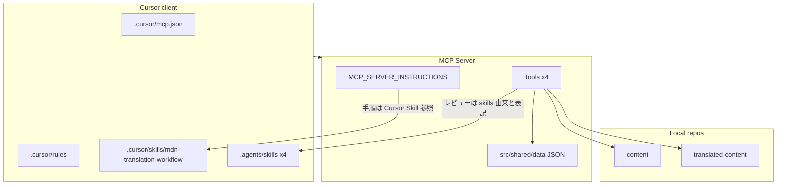

# MCP / Cursor / Agent Skills の責務棚卸し

親 Issue: [#103](https://github.com/gurezo/mdn-translation-ja-mcp/issues/103)
本 Issue: [#104](https://github.com/gurezo/mdn-translation-ja-mcp/issues/104)

後続: アーキテクチャ境界の確定は [#105](https://github.com/gurezo/mdn-translation-ja-mcp/issues/105)（[mcp-native.md](./mcp-native.md)）。本文書の分類は棚卸し時点の **移行候補** である。責務の決定は mcp-native.md を正とする。

## 目的

`mdn-translation-ja-mcp` には、MCP Tools、`.cursor`、`.agents/skills` など複数の場所に MDN 日本語翻訳の知識と手順が分散している。MCP-native 化（#103）の前に、それぞれが現在どの役割を担っているかを一覧し、次の 5 分類へ割り当てる。

1. MCP Tool に置くべきもの
2. MCP Resource に置くべきもの
3. MCP Prompt に置くべきもの
4. MCP クライアント固有設定として残すもの
5. 廃止可能なもの

本 Issue の成果物はこの文書のみである。ランタイムコードの変更、ディレクトリ再配置、README / GitHub Pages の本格更新は行わない（それぞれ #105 以降 / #111）。

## 調査範囲

| 対象 | パス |
| --- | --- |
| MCP サーバー実装 | `src/`（Tools、instructions、review、shared） |
| Cursor 固有設定 | `.cursor/`（mcp.json、rules、skills、settings） |
| Agent Skills | `.agents/skills/` |
| 機械チェック用データ | `src/shared/data/` |
| Cursor 向けセットアップ | `scripts/setup-translated-content-cursor.mjs` |
| 利用例 | `integrations/cursor/` |
| 利用者向け手順 | `README.md` |
| GitHub Pages | `docs/`（TypeDoc 出力） |

## 現状の配置

```text
Cursor
 ├─ .cursor/mcp.json
 ├─ .cursor/rules
 ├─ .cursor/skills
 └─ .agents/skills
        ↓
   MCP Server（Tools のみ）
   ├─ MCP_SERVER_INSTRUCTIONS
   └─ src/shared/data
        ↓
   content / translated-content
```



要点:

- MCP サーバーは **Tools のみ** を登録している。`registerResource` / `registerPrompt` は未使用。
- `MCP_SERVER_INSTRUCTIONS` は翻訳手順を `.cursor/skills/mdn-translation-workflow` へ誘導する。MCP サーバー単体では標準ワークフローを完結できない。
- `mdn_trans_review` の説明は「`.agents/skills` 由来」と書くが、ランタイムは Skills ファイルを読まず `src/shared/data` の JSON を使う。

## 5 分類の枠

以降の節で各機能を次へ割り当てる。割り当ては #105 で確定するまでの候補である。

| 分類 | 意味 | 本リポジトリでの現状 |
| --- | --- | --- |
| MCP Tool | 副作用のある操作、または機械実行可能な検査 | 4 Tools が存在 |
| MCP Resource | クライアントが読むガイドライン・用語・ルールデータ | 未登録 |
| MCP Prompt | 標準翻訳フロー・呼び出し制約などの手順テンプレート | 未登録 |
| クライアント固有 | Cursor の UI / Agent UX に依存する設定 | `.cursor` と setup スクリプト |
| 廃止候補 | 重複・残骸。本 Issue では削除しない | 後述 |

## Cursor Rules / Skills の役割

`.cursor/` は Cursor クライアント固有の接続設定・エージェント制約・ワークフロー知識である。翻訳作業では `translated-content` 側へコピーまたは symlink しないと、MCP サーバー接続だけでは同じ体験にならない。

### `.cursor/mcp.json`

| 項目 | 内容 |
| --- | --- |
| 役割 | 本リポジトリを Cursor で開いたときの MCP サーバー起動設定（stdio） |
| サーバー名 | `mdn-translation-ja` |
| 起動 | `node ${workspaceFolder}/dist/index.js` |
| 環境変数 | `MDN_CONTENT_ROOT` / `MDN_TRANSLATED_CONTENT_ROOT`（兄弟ディレクトリ想定） |
| 必須性 | Cursor で本サーバーを使うには同等の設定が必要。形式は Cursor 固有 |

`translated-content` ワークスペースでは、このファイルではなく `translated-content/.cursor/mcp.json`（setup スクリプトまたは examples から生成）を使う。

### `.cursor/rules/00-mdn-translation.mdc`

| 項目 | 内容 |
| --- | --- |
| 役割 | MDN 日本語翻訳の基本制約（原則・非翻訳対象・用語マクロ・フォーマット） |
| 適用 | `globs: ["**/*.md"]`、`alwaysApply: false` |
| 含む知識 | です・ます調、コードブロック非翻訳、`{{glossary}}` 2 引数、メニューは `"ラベル"` |
| 他への誘導 | MCP 呼び出しは `01-mdn-mcp-tools.mdc`、詳細ガイドラインは `.agents/skills/` |
| 重複 | `.agents/skills` の l10n / japanese-style / glossary と原則が重なる |

### `.cursor/rules/01-mdn-mcp-tools.mdc`

| 項目 | 内容 |
| --- | --- |
| 役割 | MCP ツールをシェルコマンドと誤認しないための呼び出し制約 |
| 適用 | `globs: ["**/*"]`、`alwaysApply: true` |
| 含む知識 | 4 ツール名、`mdn_trans_review` の `jaFile`、読み取り専用制約、CLI フォールバック、`translated-content` ワークスペースでの接続先 |
| 必須性 | Cursor エージェントがツール名をターミナルで実行しようとする問題への対策。他 MCP クライアントでは不要な場合がある |

### `.cursor/skills/mdn-translation-workflow/SKILL.md`

| 項目 | 内容 |
| --- | --- |
| 役割 | 標準翻訳フロー（開始 → 翻訳 → sourceCommit → glossary → レビュー） |
| 前提 | 3 リポジトリが兄弟、`translated-content/.cursor/mcp.json` 済み、Rules のコピー推奨 |
| 翻訳実施時 | `.agents/skills` の 4 スキルを参照するよう指示 |
| MCP との関係 | `MCP_SERVER_INSTRUCTIONS` がこの Skill を「翻訳手順」として参照する |

### `.cursor/skills/mdn-translation-workflow/references/mcp-tools.md`

| 項目 | 内容 |
| --- | --- |
| 役割 | 4 Tools の対応表、パス指定、mcp.json 例、エージェント向け呼び出し手順 |
| 重複 | `01-mdn-mcp-tools.mdc`、README、`MCP_SERVER_INSTRUCTIONS` と同じ制約を再掲 |

### `.cursor/settings.json`

| 項目 | 内容 |
| --- | --- |
| 役割 | 不明。キー `mdn-wdb-doc-ja-mcp` と localhost:3000 の REST エンドポイント |
| 現状 | 現行 MCP サーバー名 `mdn-translation-ja` および stdio / Streamable HTTP 実装と一致しない |
| 扱い | 旧プロジェクト名の残骸として廃止候補（本 Issue では削除しない） |

### Cursor 側の依存関係（要約）

```text
.cursor/mcp.json          … 接続（クライアント固有）
.cursor/rules/01-*.mdc    … ツール呼び出し UX（クライアント固有、常時）
.cursor/rules/00-*.mdc    … 翻訳原則の要約（ドメイン知識の薄いコピー）
.cursor/skills/workflow   … 標準フロー（MCP Prompt 候補）
.cursor/settings.json     … 現行実装と無関係
```

翻訳作業ワークスペース（`translated-content`）では、上記のうち接続設定と `01-mdn-mcp-tools.mdc` 相当が setup スクリプトで複製される。`00-mdn-translation.mdc` と workflow Skill、`.agents/skills` は README 上「任意」だが、人手翻訳・手順遵守には事実上必要になっている。

## Agent Skills の役割

`.agents/skills/` は mozilla-japan 翻訳ガイドラインを Cursor Agent Skill 形式にしたもの。人手の翻訳・レビュー用のドメイン知識であり、MCP サーバーは実行時にこれらの Markdown を読まない。

`mdn_trans_review` はスキル名（`REVIEW_SKILL_ORDER`）で検出をグループ化するが、検査本体は `src/shared/data` へ抽出した JSON と専用チェッカーである。

### 共通構造

各スキルは `SKILL.md`（いつ使うか・チェックリスト・手順）と `references/`（出典から抜粋した詳細）からなる。

| Skill | 出典 |
| --- | --- |
| `editorial-guideline` | https://github.com/mozilla-japan/translation/wiki/Editorial-Guideline |
| `l10n-guideline` | https://github.com/mozilla-japan/translation/wiki/L10N-Guideline |
| `mozilla-l10n-glossary` | https://github.com/mozilla-japan/translation/wiki/Mozilla-L10N-Glossary |
| `japanese-style` | 日本語の文体スプレッドシート（style-rules.md の sourceUrl） |

### `editorial-guideline`

| 項目 | 内容 |
| --- | --- |
| 役割 | 表記・約物・単位・カタカナ長音・ブランディング・頻出用語 |
| 人手 | 半角スペース、日付・数字・容量、メニュー `[項目]`、引用符「」 |
| 機械チェックへ抽出 | 禁止約物（―、～）、頻出語（ウェブアプリケーション、ブラウザー、バイナリー、構文、ログイン等）、MDN 見出し慣行（仕様書 / ブラウザーの互換性） |
| 機械に載っていない例 | カタカナ長音の一般規則、単位の詳細、メニュー三点リーダー省略 |

禁止表現リスト `prohibited-expressions.json` も editorial-guideline スキル名で報告される（プレースホルダ「要翻訳」等）。references 本文からの直接抽出ではない。

### `l10n-guideline`

| 項目 | 内容 |
| --- | --- |
| 役割 | 意訳・自然な日本語、UI コンテクスト別表現、です・ます調、L10N メタデータ |
| 人手 | 逐語訳回避、UI の体言止め / 動詞末尾、「Web」→「ウェブ」、括弧前後の空白 |
| 機械チェック | `findingsFromL10nMetadata`: front-matter の `l10n.sourceCommit` のみ（ルール ID `STYLE_L10N_METADATA`） |
| 機械に載っていない例 | 意訳の自然さ、UI コンテクスト別フレーズ |

`STYLE_L10N_METADATA` は japanese-style の ID 表にも載るが、実装の `skill` フィールドは `l10n-guideline`。

### `mozilla-l10n-glossary`

| 項目 | 内容 |
| --- | --- |
| 役割 | 英語技術用語の訳語と `{{glossary("id", "表示名")}}` の第 2 引数 |
| 人手 | `glossary-excerpt.md` 検索、未掲載時は Wiki（`glossary-lookup.md`） |
| 機械 | `mdn_trans_replace_glossary` が `glossary-terms.json` で第 2 引数を補完。`mdn_trans_review` は 1 引数マクロを `GLOSSARY_SINGLE_ARG` として検出 |
| JSON との関係 | Skill 本文が `src/shared/data/glossary-terms.json` を MCP 用語データとして明示。excerpt は人が読む抜粋、JSON は機械用のサブセット |

### `japanese-style`

| 項目 | 内容 |
| --- | --- |
| 役割 | です・ます調、ひらがな / 漢字、箇条書き・手順の文体 |
| 人手確認 ID | `STYLE_KATAKANA_AND_GLOSSARY_CONSISTENCY`、`STYLE_LIST_AND_PROCEDURE_VOICE` |
| 機械チェック | `STYLE_HIRAGANA_*`（下さい / の為 / 出来る / 全て / 読込み / 貼付け）、`STYLE_DESU_MASU_*`（である。 / だ。） |
| ID のずれ | 人手用 ID `STYLE_DESU_MASU_AND_DEARU_MIX` に対し、機械側 ID は `STYLE_DESU_MASU_DEARU` / `STYLE_DESU_MASU_DA` |

### Agent Skills と MCP の関係（要約）

```text
.agents/skills/*/SKILL.md + references/
        │ 人手翻訳・人手レビュー
        │
        ├─ 抽出済み ─► src/shared/data/*.json  ─► mdn_trans_review
        │                                         mdn_trans_replace_glossary
        └─ 未抽出   ─► エージェントが Skill を読んで判断（MCP 未接続では届かない）
```

translated-content ワークスペースで Skills を使わない場合、機械チェック可能なサブセット以外のガイドラインはエージェントに届かない。これが「MCP を繋いだだけでは想定した翻訳体験にならない」主因の一つである。

## MCP Tools と Skill / data の依存関係

### トランスポートと入口

| 入口 | パス | 役割 |
| --- | --- | --- |
| stdio | `src/index.ts` → `createMcpServer()` | Cursor の `mcp.json` `command` から起動 |
| Streamable HTTP | `src/http.ts` → 同じ `createMcpServer()` | `npm run start:http`。機能集合は stdio と同一 |
| CLI フォールバック | `src/cli/review.ts` | `npm run mdn:trans:review`。`mdn_trans_review` 相当。MCP 未接続時のみ |

Resources / Prompts は未登録。サーバー説明は `src/mcp-server-instructions.ts` の `MCP_SERVER_INSTRUCTIONS`（Cursor のサーバー指示）。

### ワークスペース解決

全 Tools が `resolveWorkspaceRoots()`（`src/shared/workspace.ts`）を使う。

1. `MDN_CONTENT_ROOT` と `MDN_TRANSLATED_CONTENT_ROOT` を両方指定
2. 未設定ならプロセス cwd の親にある `content` / `translated-content`

Skill ファイルは参照しない。パス解決は環境変数とディレクトリ配置のみ。

### Tools 一覧と依存

| Tool | 実装 | 書き込み | Skill 依存 | data 依存 | その他 |
| --- | --- | --- | --- | --- | --- |
| `mdn_trans_start` | `src/tools/trans-start.ts` | `translated-content` へ原文コピー | なし | なし | URL 解決 `mdn-url-resolve.ts` |
| `mdn_trans_commit_get` | `src/tools/commit-get.ts` | `l10n.sourceCommit` を書き込み | なし | なし | git `get-source-commit.ts`、front-matter |
| `mdn_trans_replace_glossary` | `src/tools/replace-glossary.ts` | 第 2 引数付きに置換して保存 | なし（JSON のみ） | `glossary-terms.json` | `glossary-macro.ts` |
| `mdn_trans_review` | `src/tools/review.ts` | なし（readOnlyHint） | なし（ランタイムは JSON + チェッカー） | `review-rules.json`、`prohibited-expressions.json` | スキル名は結果のグループ化にのみ使用 |

`mdn_trans_review` の説明文・レポートは「`.agents/skills` 由来」と書くが、ファイル I/O は対象 `index.md` の読み取りと `src/shared/data`（ビルド後は `dist/shared/data`）のみ。

### `src/shared/data`

`scripts/copy-shared-data.mjs` が `tsc` 後に JSON を `dist/shared/data` へ複製する。パス解決は `src/shared/paths.ts`。

| ファイル | 利用者 | 由来 | 内容 |
| --- | --- | --- | --- |
| `glossary-terms.json` | `mdn_trans_replace_glossary` | 用語集の機械用サブセット | 11 語。`id` → `secondArg` |
| `review-rules.json` | `mdn_trans_review`（`findingsFromRuleItems`） | `.agents/skills` references から抽出と明記 | 禁止約物、頻出語、見出し慣行、ひらがな、だ・であるヒューリスティック |
| `prohibited-expressions.json` | `mdn_trans_review`（`findingsFromProhibited`） | editorial-guideline を前提にした初期リスト | 「要翻訳」等のプレースホルダと TODO / FIXME / [WIP] |

`review-rules.json` の `skill` フィールドは editorial-guideline / japanese-style。l10n と glossary の機械チェックは JSON ではなく専用チェッカー。

#### データとガイドラインのずれ

- `glossary-terms.json` の `browser.secondArg` は「ブラウザ」。`review-rules.json` の `EDITORIAL_TERM_BROWSER_SHORT` と glossary-lookup.md は「ブラウザー」を要求する。
- `review-rules.json` の `retrievedAt` は 2026-06-02、`prohibited-expressions.json` は 2026-03-22、Skill references の `retrievedAt` は 2026-05-31。同期元が一つではない。

### レビューエンジン

`src/review/run-guideline-review.ts` が次を合成する。

| チェッカー | ソース | 報告スキル |
| --- | --- | --- |
| `findingsFromRuleItems` | `review-rules.json` | 各 item の `skill` |
| `findingsFromProhibited` | `prohibited-expressions.json` | 常に `editorial-guideline` |
| `findingsFromL10nMetadata` | front-matter | `l10n-guideline`（`STYLE_L10N_METADATA`） |
| `findingsFromGlossaryMacros` | 本文の 1 引数 `{{glossary}}` | `mozilla-l10n-glossary`（`GLOSSARY_SINGLE_ARG`） |

`REVIEW_SKILL_ORDER` は 4 スキル名。未自動項目（意訳、カタカナと glossary の整合、リスト文体）はレポートで人手確認を促すだけ。

### `MCP_SERVER_INSTRUCTIONS` が依存する Cursor 側知識

`src/mcp-server-instructions.ts` は次をサーバー指示に含める。

- 4 Tools はシェルではない
- `mdn_trans_review` は読み取り専用
- 兄弟ディレクトリまたは環境変数
- `mdn_trans_start` はコピーのみ
- **「MCP 翻訳手順は `.cursor/skills/mdn-translation-workflow` を参照」**

最後の行により、MCP サーバーの利用説明が Cursor Skill パスに結合している。他クライアントではこのパスは存在しない。

## setup / examples / README / GitHub Pages

### `scripts/setup-translated-content-cursor.mjs`

`npm run setup:translated-content-cursor`。`translated-content/.cursor/` に次を生成する。

- `mcp.json`（`dist/index.js` の絶対パスと環境変数）
- `rules/01-mdn-mcp-tools.mdc`（`integrations/cursor/rules/` からコピー）

`.agents/skills` と workflow Skill、`00-mdn-translation.mdc` はコピーしない。README では別途 symlink / コピーを「任意」と案内する。

Cursor 向け必須セットアップの中核。他 MCP クライアントでは不要。

### `integrations/cursor/`

| ファイル | 役割 |
| --- | --- |
| `mcp.example.json` | `translated-content/.cursor/mcp.json` の雛形（絶対パスのプレースホルダ） |
| `rules/01-mdn-mcp-tools.mdc` | setup がコピーする Rule。本リポジトリの `.cursor/rules/01-mdn-mcp-tools.mdc` より短い（CLI フォールバックと workspace 節が簡略） |

### README.md

Cursor 前提の利用者向け手順。調査対象としての役割:

- 3 リポジトリ並列、fork → clone、`translated-content/.cursor/mcp.json`
- setup スクリプトと Rules コピー
- 翻訳フロー最短（4 Tools の順序）
- Skills / Rules の任意展開（symlink）
- トラブルシュート（MCP をシェルと誤認した場合を含む）

MCP 指示・Rules・workflow Skill と内容が重複する。本格更新は #111。

### GitHub Pages（`docs/`）

TypeDoc の API リファレンスのみ（`typedoc.json` の `out: "docs"`）。`npm run docs:clean` がディレクトリを削除するため、本棚卸し文書はここに置かない。

アーキテクチャ・責務・翻訳ガイドラインは Pages に未掲載。公開面の更新は #111。

## MCP 移行対象と Cursor 残置の分類

以下は現状に基づく **移行候補** である。Tools / Resources / Prompts の責務確定、Cursor integration の配置、既存 API 互換は [#105](https://github.com/gurezo/mdn-translation-ja-mcp/issues/105) が行う。本 Issue ではファイルを移動・削除しない。

### 1. MCP Tool に置くべきもの

副作用のある操作と、機械実行可能な検査。粒度の再設計は [#108](https://github.com/gurezo/mdn-translation-ja-mcp/issues/108)。

| 現状 | 理由 |
| --- | --- |
| `mdn_trans_start` | 原文ファイルのコピー |
| `mdn_trans_commit_get` | git 履歴取得と front-matter 書き込み |
| `mdn_trans_replace_glossary` | 用語 JSON に基づく本文置換 |
| `mdn_trans_review` | 機械レビュー（読み取り専用） |

CLI `mdn:trans:review` は Tool のフォールバックであり、MCP の必須面にはしない。stdio / HTTP は同じ Tool 集合を維持する。

### 2. MCP Resource に置くべきもの

クライアントが読む翻訳知識。実装は [#106](https://github.com/gurezo/mdn-translation-ja-mcp/issues/106)。

| 現状の置き場 | Resource 化する内容 |
| --- | --- |
| `.agents/skills/editorial-guideline/references/` | 表記ガイドライン |
| `.agents/skills/l10n-guideline/references/` | L10N ガイドライン |
| `.agents/skills/japanese-style/references/style-rules.md` | 文体ルール |
| `.agents/skills/mozilla-l10n-glossary/references/` | 用語抜粋と Wiki 参照手順 |
| `src/shared/data/glossary-terms.json` | 機械用 glossary（Tool も継続利用） |
| `src/shared/data/review-rules.json` | 機械チェックルール |
| `src/shared/data/prohibited-expressions.json` | 禁止・注意表現 |

Skill の `SKILL.md`（When to use / checklist）は Resource の短い案内にするか、Prompt 側の手順に含めるか #105 で決める。

### 3. MCP Prompt に置くべきもの

標準手順と呼び出し制約。実装は [#107](https://github.com/gurezo/mdn-translation-ja-mcp/issues/107)。

| 現状の置き場 | Prompt 化する内容 |
| --- | --- |
| `.cursor/skills/mdn-translation-workflow/SKILL.md` | 翻訳開始 → 翻訳 → sourceCommit → glossary → レビュー |
| `.cursor/skills/mdn-translation-workflow/references/mcp-tools.md` | ツール対応表とパス指定 |
| `MCP_SERVER_INSTRUCTIONS` の手順・制約 | シェル誤認禁止、review 読み取り専用、コピーのみ、パス規則 |
| `.cursor/rules/01-mdn-mcp-tools.mdc` の制約本文 | 同上（Cursor Rule としては optional に縮小） |
| `.cursor/rules/00-mdn-translation.mdc` の翻訳原則 | ドメイン要約。Resource と重複するため Prompt の前提節か Resource へ |

サーバー instructions を Prompt / Resource へ寄せたあと、instructions は「Prompt を使え」程度に薄くできる。#105 の互換方針待ち。

### 4. MCP クライアント固有設定として残すもの

Cursor の UI / Agent UX。MCP 利用の必須条件にはしない（#109 で必須依存を外す）。

| 現状 | 残す理由 |
| --- | --- |
| `.cursor/mcp.json`（本リポジトリ） | Cursor のサーバー登録形式 |
| `translated-content/.cursor/mcp.json` の生成 | 同上。他クライアントは各自の設定形式 |
| `scripts/setup-translated-content-cursor.mjs` | Cursor 向け一括セットアップ |
| `integrations/cursor/` | Cursor 向け雛形 |
| `.cursor/rules/01-mdn-mcp-tools.mdc` の薄い残置 | Cursor エージェントがツール名をシェル実行する問題への optional 対策 |
| `.cursor/skills` の残置 | Cursor で Skill を開く UX が便利なら optional integration |

#105 の目標配置 `integrations/cursor/` は、上記 optional 群の行き先候補である。

### 5. 廃止可能なもの（候補。本 Issue では削除しない）

| 対象 | 理由 |
| --- | --- |
| `.cursor/settings.json` の `mdn-wdb-doc-ja-mcp` | 現行サーバー名・トランスポートと不一致。旧プロジェクト残骸 |
| MCP 呼び出し制約の多重コピー | instructions / Rules / Skill / examples Rule / README の 5 系統。Prompt へ集約したあと冗長分を落とせる |
| `.cursor/rules/00-mdn-translation.mdc` の独立維持 | Agent Skills / 将来 Resource の要約コピー。Prompt か Resource があれば必須ではない |
| `glossary-terms.json` の `browser` → 「ブラウザ」 | 表記ルール「ブラウザー」と矛盾。廃止というよりデータ修正候補（#106 または glossary 系 Issue） |

「廃止」はファイル削除を意味しない。親 Issue #103 のとおり、便利な Cursor UX は optional として残してよい。

### 分類マトリクス（要約）

| 要素 | Tool | Resource | Prompt | クライアント固有 | 廃止候補 |
| --- | --- | --- | --- | --- | --- |
| 4 MCP Tools | 残す | | | | |
| `src/shared/data/*.json` | Tool が読む | 公開する | | | 用語の矛盾は修正候補 |
| `.agents/skills` references | | 公開する | | optional Skill として残せる | |
| workflow Skill | | | 公開する | optional | |
| `MCP_SERVER_INSTRUCTIONS` | | | 寄せる | | 重複分は縮小 |
| `.cursor/rules/01-*` | | | 本文を寄せる | 薄い Rule として残せる | 冗長コピー |
| `.cursor/rules/00-*` | | または Prompt | または Prompt | | 独立維持は不要になり得る |
| setup / examples / mcp.json | | | | 残す | |
| `.cursor/settings.json` | | | | | 残骸 |

## 重複ルール・ワークフロー

同一趣旨が複数の置き場にあり、MCP 接続だけではどれが正本か分からない。

### MCP ツールをシェルで実行するな / review は読み取り専用

同じ制約が次に繰り返し書かれている。

| 置き場 | 差分 |
| --- | --- |
| `src/mcp-server-instructions.ts` | 最優先として 4 ツール名と review 読み取り専用 |
| `.cursor/rules/01-mdn-mcp-tools.mdc` | alwaysApply。CLI フォールバックと setup 案内あり |
| `integrations/cursor/rules/01-mdn-mcp-tools.mdc` | 上記の短縮版。setup がこちらをコピー |
| `.cursor/skills/mdn-translation-workflow/SKILL.md` | ツール対応表とチャット例 |
| `.cursor/skills/mdn-translation-workflow/references/mcp-tools.md` | 対応表・mcp.json 例・呼び出し手順 |
| `.cursor/rules/00-mdn-translation.mdc` | MCP 節で 01 へ誘導、review 制約を再掲 |
| `README.md` | ツール表、チャット例、トラブルシュート |
| `mdn_trans_review` の description と `REVIEW_READ_ONLY_BANNER` | ツール応答にも同じ制約 |

正本候補は MCP Prompt（＋ Tool の annotations / structuredContent）。Cursor Rule は optional な再掲に縮小できる。

### 標準翻訳フロー（5 手順）

| 置き場 | 内容 |
| --- | --- |
| `.cursor/skills/mdn-translation-workflow/SKILL.md` | start → `.agents/skills` で翻訳 → commit_get → replace_glossary → review |
| `README.md`「翻訳フロー（最短）」 | 同じ 4 Tools の順序。翻訳実施（人手）の節は短い |
| `MCP_SERVER_INSTRUCTIONS` | フロー本体は書かず Skill パスへ誘導 |

正本候補は MCP Prompt。README は #111 で Prompt への参照に寄せる。

### 翻訳原則（です・ます、コード非翻訳、意訳）

| 置き場 | 内容 |
| --- | --- |
| `.cursor/rules/00-mdn-translation.mdc` | 要約。`**/*.md` に条件適用 |
| `.agents/skills/l10n-guideline` | 意訳・ですます・UI・メタデータ |
| `.agents/skills/japanese-style` | ですます混在、ひらがな、リスト文体 |
| `review-rules.json` の `STYLE_DESU_MASU_*` | である。 / だ。 のヒューリスティック |

00 Rule は Skills の薄いコピー。Resource 公開後は必須でなくなる。

### 用語・表記

| 置き場 | 機械 / 人手 |
| --- | --- |
| `.agents/skills/editorial-guideline/references` | 人手。長音・単位・メニューなど |
| `.agents/skills/mozilla-l10n-glossary/references` | 人手。excerpt + Wiki 手順 |
| `review-rules.json` | 機械。頻出語・禁止約物・見出しのサブセット |
| `prohibited-expressions.json` | 機械。プレースホルダ |
| `glossary-terms.json` | 機械。11 語の第 2 引数 |

抽出漏れ（長音規則など）とデータの矛盾（「ブラウザ」 vs 「ブラウザー」）がある。Resource 化時に正本を一つに揃える必要がある（#106）。

### ルール ID の所属ずれ

| ID | Skill 文書上の所属 | 実装の `skill` |
| --- | --- | --- |
| `STYLE_L10N_METADATA` | japanese-style の ID 表 | `l10n-guideline`（`l10n-metadata.ts`） |
| `STYLE_DESU_MASU_AND_DEARU_MIX` | japanese-style の人手 ID | 機械 ID は `STYLE_DESU_MASU_DEARU` / `STYLE_DESU_MASU_DA` |
| `STYLE_KATAKANA_AND_GLOSSARY_CONSISTENCY` | japanese-style | 未自動 |
| `STYLE_LIST_AND_PROCEDURE_VOICE` | japanese-style | 未自動 |

レビュー結果のスキル別集計と Skill 文書の ID 表が一致しない。

### Cursor セットアップ手順の重複

| 置き場 | 内容 |
| --- | --- |
| `README.md`「translated-content リポジトリ側で行うこと」 | mcp.json 手書き、setup、Rules コピー、Skills 任意 |
| `scripts/setup-translated-content-cursor.mjs` の stdout | 生成後の Cursor リロード手順 |
| workflow Skill の Prerequisites | 3 リポジトリ兄弟、mcp.json、Rules コピー推奨 |

#109 / #111 で「MCP サーバー登録だけ」に寄せると、この塊を縮小できる。

## #105 へ渡す未決事項

本文書は分類候補までとする。決定は [mcp-native.md](./mcp-native.md) を正とする。

- Tools / Resources / Prompts の責務定義とディレクトリ構成（`integrations/cursor/` を含む）
- `MCP_SERVER_INSTRUCTIONS` を Prompt へ移したあとのサーバー指示の残量
- `.agents/skills` を Resource のソース・オブ・トゥルースにするか、shared domain を別に切るか
- `src/shared/data` と Skill references の同期方法（単一ソース）
- 既存 4 Tools の名前・引数を #108 まで維持するか
- Cursor Rule / Skill を optional として残す最小セット
- stdio / HTTP 以外のクライアント（Claude Code / VS Code 等）で Resource / Prompt をどう見せるか（#110）

## Issue #104 の完了対応

| 完了条件 | この文書での対応 |
| --- | --- |
| `.cursor` の全 Rules / Skills の役割が一覧化されている | 「Cursor Rules / Skills の役割」 |
| `.agents/skills` の全 Skill の役割が一覧化されている | 「Agent Skills の役割」 |
| MCP Tools が依存している Skill / data が明確になっている | 「MCP Tools と Skill / data の依存関係」 |
| MCP へ移行するものと Cursor 側へ残すものが分類されている | 「MCP 移行対象と Cursor 残置の分類」 |
| 重複しているルール・ワークフローが特定されている | 「重複ルール・ワークフロー」 |
