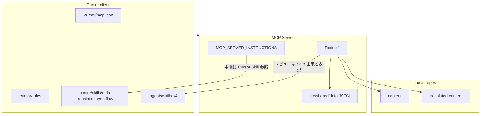

# MCP / Cursor / Agent Skills の責務棚卸し

親 Issue: [#103](https://github.com/gurezo/mdn-translation-ja-mcp/issues/103)
本 Issue: [#104](https://github.com/gurezo/mdn-translation-ja-mcp/issues/104)

後続: アーキテクチャ境界の確定は [#105](https://github.com/gurezo/mdn-translation-ja-mcp/issues/105)。本文書の分類は **移行候補** であり、最終決定ではない。

## 目的

`mdn-translation-ja-mcp` には、MCP Tools、`.cursor`、`.agents/skills` など複数の場所に MDN 日本語翻訳の知識と手順が分散している。MCP-native 化（#103）の前に、それぞれが現在どの役割を担っているかを一覧し、次の 5 分類へ割り当てる。

1. MCP Tool に置くべきもの
2. MCP Resource に置くべきもの
3. MCP Prompt に置くべきもの
4. MCP クライアント固有設定として残すもの
5. 廃止可能なもの

本 Issue の成果物はこの文書のみである。ランタイムコードの変更、ディレクトリ再配置、README / GitHub Pages の本格更新は行わない（それぞれ #105 以降 / #111）。

## 調査範囲

| 対象 | パス |
| --- | --- |
| MCP サーバー実装 | `src/`（Tools、instructions、review、shared） |
| Cursor 固有設定 | `.cursor/`（mcp.json、rules、skills、settings） |
| Agent Skills | `.agents/skills/` |
| 機械チェック用データ | `src/shared/data/` |
| Cursor 向けセットアップ | `scripts/setup-translated-content-cursor.mjs` |
| 利用例 | `examples/translated-content-*` |
| 利用者向け手順 | `README.md` |
| GitHub Pages | `docs/`（TypeDoc 出力） |

## 現状の配置

```text
Cursor
 ├─ .cursor/mcp.json
 ├─ .cursor/rules
 ├─ .cursor/skills
 └─ .agents/skills
        ↓
   MCP Server（Tools のみ）
   ├─ MCP_SERVER_INSTRUCTIONS
   └─ src/shared/data
        ↓
   content / translated-content
```



要点:

- MCP サーバーは **Tools のみ** を登録している。`registerResource` / `registerPrompt` は未使用。
- `MCP_SERVER_INSTRUCTIONS` は翻訳手順を `.cursor/skills/mdn-translation-workflow` へ誘導する。MCP サーバー単体では標準ワークフローを完結できない。
- `mdn_trans_review` の説明は「`.agents/skills` 由来」と書くが、ランタイムは Skills ファイルを読まず `src/shared/data` の JSON を使う。

## 5 分類の枠

以降の節で各機能を次へ割り当てる。割り当ては #105 で確定するまでの候補である。

| 分類 | 意味 | 本リポジトリでの現状 |
| --- | --- | --- |
| MCP Tool | 副作用のある操作、または機械実行可能な検査 | 4 Tools が存在 |
| MCP Resource | クライアントが読むガイドライン・用語・ルールデータ | 未登録 |
| MCP Prompt | 標準翻訳フロー・呼び出し制約などの手順テンプレート | 未登録 |
| クライアント固有 | Cursor の UI / Agent UX に依存する設定 | `.cursor` と setup スクリプト |
| 廃止候補 | 重複・残骸。本 Issue では削除しない | 後述 |

## Cursor Rules / Skills の役割

`.cursor/` は Cursor クライアント固有の接続設定・エージェント制約・ワークフロー知識である。翻訳作業では `translated-content` 側へコピーまたは symlink しないと、MCP サーバー接続だけでは同じ体験にならない。

### `.cursor/mcp.json`

| 項目 | 内容 |
| --- | --- |
| 役割 | 本リポジトリを Cursor で開いたときの MCP サーバー起動設定（stdio） |
| サーバー名 | `mdn-translation-ja` |
| 起動 | `node ${workspaceFolder}/dist/index.js` |
| 環境変数 | `MDN_CONTENT_ROOT` / `MDN_TRANSLATED_CONTENT_ROOT`（兄弟ディレクトリ想定） |
| 必須性 | Cursor で本サーバーを使うには同等の設定が必要。形式は Cursor 固有 |

`translated-content` ワークスペースでは、このファイルではなく `translated-content/.cursor/mcp.json`（setup スクリプトまたは examples から生成）を使う。

### `.cursor/rules/00-mdn-translation.mdc`

| 項目 | 内容 |
| --- | --- |
| 役割 | MDN 日本語翻訳の基本制約（原則・非翻訳対象・用語マクロ・フォーマット） |
| 適用 | `globs: ["**/*.md"]`、`alwaysApply: false` |
| 含む知識 | です・ます調、コードブロック非翻訳、`{{glossary}}` 2 引数、メニューは `"ラベル"` |
| 他への誘導 | MCP 呼び出しは `01-mdn-mcp-tools.mdc`、詳細ガイドラインは `.agents/skills/` |
| 重複 | `.agents/skills` の l10n / japanese-style / glossary と原則が重なる |

### `.cursor/rules/01-mdn-mcp-tools.mdc`

| 項目 | 内容 |
| --- | --- |
| 役割 | MCP ツールをシェルコマンドと誤認しないための呼び出し制約 |
| 適用 | `globs: ["**/*"]`、`alwaysApply: true` |
| 含む知識 | 4 ツール名、`mdn_trans_review` の `jaFile`、読み取り専用制約、CLI フォールバック、`translated-content` ワークスペースでの接続先 |
| 必須性 | Cursor エージェントがツール名をターミナルで実行しようとする問題への対策。他 MCP クライアントでは不要な場合がある |

### `.cursor/skills/mdn-translation-workflow/SKILL.md`

| 項目 | 内容 |
| --- | --- |
| 役割 | 標準翻訳フロー（開始 → 翻訳 → sourceCommit → glossary → レビュー） |
| 前提 | 3 リポジトリが兄弟、`translated-content/.cursor/mcp.json` 済み、Rules のコピー推奨 |
| 翻訳実施時 | `.agents/skills` の 4 スキルを参照するよう指示 |
| MCP との関係 | `MCP_SERVER_INSTRUCTIONS` がこの Skill を「翻訳手順」として参照する |

### `.cursor/skills/mdn-translation-workflow/references/mcp-tools.md`

| 項目 | 内容 |
| --- | --- |
| 役割 | 4 Tools の対応表、パス指定、mcp.json 例、エージェント向け呼び出し手順 |
| 重複 | `01-mdn-mcp-tools.mdc`、README、`MCP_SERVER_INSTRUCTIONS` と同じ制約を再掲 |

### `.cursor/settings.json`

| 項目 | 内容 |
| --- | --- |
| 役割 | 不明。キー `mdn-wdb-doc-ja-mcp` と localhost:3000 の REST エンドポイント |
| 現状 | 現行 MCP サーバー名 `mdn-translation-ja` および stdio / Streamable HTTP 実装と一致しない |
| 扱い | 旧プロジェクト名の残骸として廃止候補（本 Issue では削除しない） |

### Cursor 側の依存関係（要約）

```text
.cursor/mcp.json          … 接続（クライアント固有）
.cursor/rules/01-*.mdc    … ツール呼び出し UX（クライアント固有、常時）
.cursor/rules/00-*.mdc    … 翻訳原則の要約（ドメイン知識の薄いコピー）
.cursor/skills/workflow   … 標準フロー（MCP Prompt 候補）
.cursor/settings.json     … 現行実装と無関係
```

翻訳作業ワークスペース（`translated-content`）では、上記のうち接続設定と `01-mdn-mcp-tools.mdc` 相当が setup スクリプトで複製される。`00-mdn-translation.mdc` と workflow Skill、`.agents/skills` は README 上「任意」だが、人手翻訳・手順遵守には事実上必要になっている。

## 以降の節

- Agent Skills の役割
- MCP Tools と Skill / data の依存関係
- setup / examples / README / GitHub Pages
- MCP 移行対象と Cursor 残置の分類
- 重複ルール・ワークフロー
- #105 へ渡す未決事項
