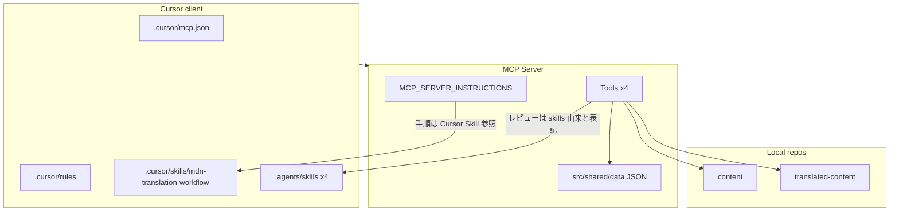

# MCP / Cursor / Agent Skills の責務棚卸し

親 Issue: [#103](https://github.com/gurezo/mdn-translation-ja-mcp/issues/103)
本 Issue: [#104](https://github.com/gurezo/mdn-translation-ja-mcp/issues/104)

後続: アーキテクチャ境界の確定は [#105](https://github.com/gurezo/mdn-translation-ja-mcp/issues/105)。本文書の分類は **移行候補** であり、最終決定ではない。

## 目的

`mdn-translation-ja-mcp` には、MCP Tools、`.cursor`、`.agents/skills` など複数の場所に MDN 日本語翻訳の知識と手順が分散している。MCP-native 化（#103）の前に、それぞれが現在どの役割を担っているかを一覧し、次の 5 分類へ割り当てる。

1. MCP Tool に置くべきもの
2. MCP Resource に置くべきもの
3. MCP Prompt に置くべきもの
4. MCP クライアント固有設定として残すもの
5. 廃止可能なもの

本 Issue の成果物はこの文書のみである。ランタイムコードの変更、ディレクトリ再配置、README / GitHub Pages の本格更新は行わない（それぞれ #105 以降 / #111）。

## 調査範囲

| 対象 | パス |
| --- | --- |
| MCP サーバー実装 | `src/`（Tools、instructions、review、shared） |
| Cursor 固有設定 | `.cursor/`（mcp.json、rules、skills、settings） |
| Agent Skills | `.agents/skills/` |
| 機械チェック用データ | `src/shared/data/` |
| Cursor 向けセットアップ | `scripts/setup-translated-content-cursor.mjs` |
| 利用例 | `examples/translated-content-*` |
| 利用者向け手順 | `README.md` |
| GitHub Pages | `docs/`（TypeDoc 出力） |

## 現状の配置

```text
Cursor
 ├─ .cursor/mcp.json
 ├─ .cursor/rules
 ├─ .cursor/skills
 └─ .agents/skills
        ↓
   MCP Server（Tools のみ）
   ├─ MCP_SERVER_INSTRUCTIONS
   └─ src/shared/data
        ↓
   content / translated-content
```



要点:

- MCP サーバーは **Tools のみ** を登録している。`registerResource` / `registerPrompt` は未使用。
- `MCP_SERVER_INSTRUCTIONS` は翻訳手順を `.cursor/skills/mdn-translation-workflow` へ誘導する。MCP サーバー単体では標準ワークフローを完結できない。
- `mdn_trans_review` の説明は「`.agents/skills` 由来」と書くが、ランタイムは Skills ファイルを読まず `src/shared/data` の JSON を使う。

## 5 分類の枠

以降の節で各機能を次へ割り当てる。割り当ては #105 で確定するまでの候補である。

| 分類 | 意味 | 本リポジトリでの現状 |
| --- | --- | --- |
| MCP Tool | 副作用のある操作、または機械実行可能な検査 | 4 Tools が存在 |
| MCP Resource | クライアントが読むガイドライン・用語・ルールデータ | 未登録 |
| MCP Prompt | 標準翻訳フロー・呼び出し制約などの手順テンプレート | 未登録 |
| クライアント固有 | Cursor の UI / Agent UX に依存する設定 | `.cursor` と setup スクリプト |
| 廃止候補 | 重複・残骸。本 Issue では削除しない | 後述 |

## 目次（以降の節で埋める）

- Cursor Rules / Skills の役割
- Agent Skills の役割
- MCP Tools と Skill / data の依存関係
- setup / examples / README / GitHub Pages
- MCP 移行対象と Cursor 残置の分類
- 重複ルール・ワークフロー
- #105 へ渡す未決事項
